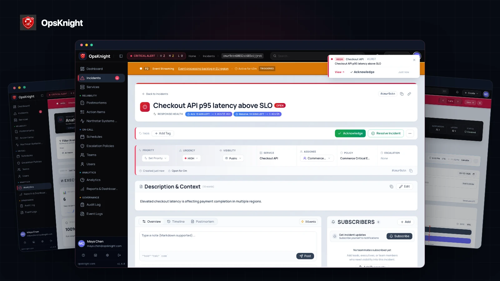
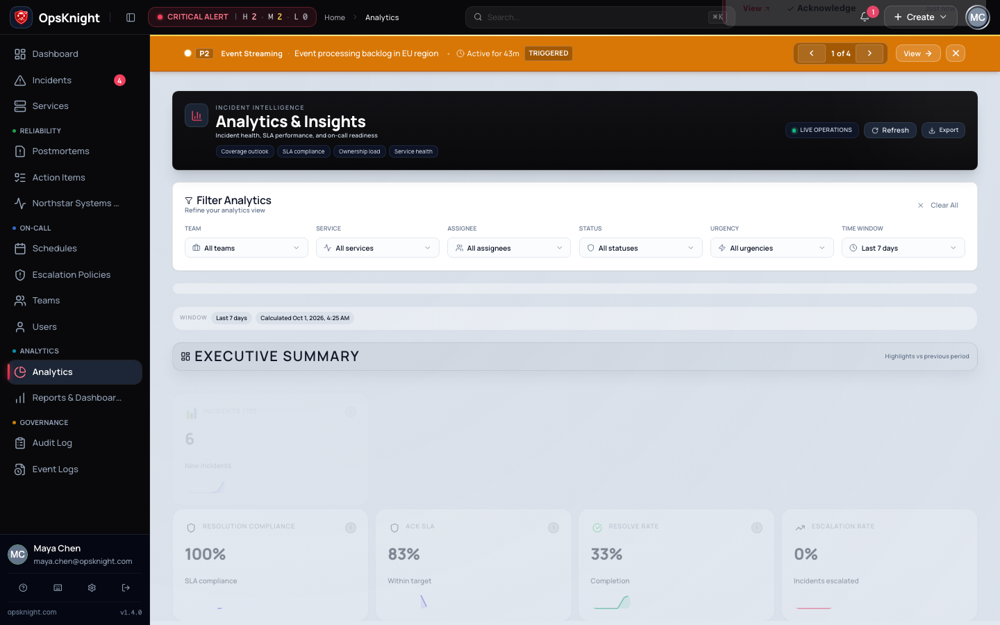
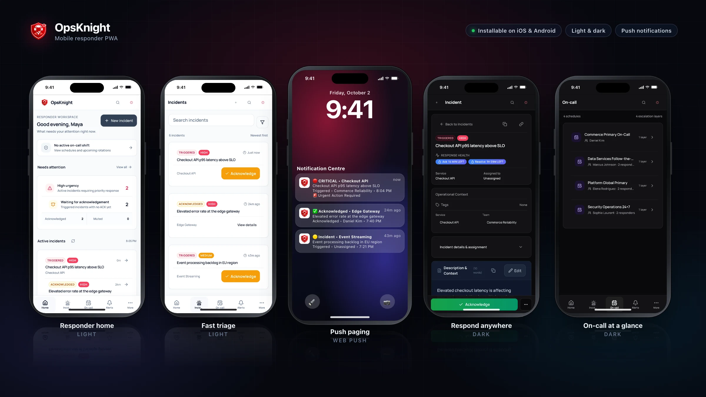
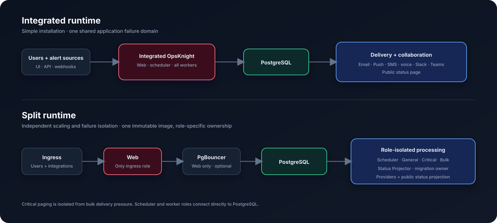

<div align="center">

<a href="https://opsknight.com/">
  
</a>

# OpsKnight

**Open-source incident management and on-call operations.**<br>
Detect, route, respond, communicate, and learn on infrastructure you control.

[**Documentation**](https://opsknight.com/docs/latest/) · [**Quick start**](#quick-start) · [**What's new in 2.0**](CHANGELOG.md) · [**Sponsor**](https://github.com/sponsors/dushyant-rahangdale)

[](https://github.com/opsknight-labs/OpsKnight/releases/tag/v2.0.0)
[](LICENSE)
[](https://github.com/opsknight-labs/OpsKnight/pkgs/container/opsknight)
[](https://github.com/opsknight-labs/OpsKnight/actions/workflows/tests.yml)
[](https://github.com/opsknight-labs/OpsKnight/actions/workflows/security.yml)

</div>

## What is OpsKnight?

OpsKnight connects the complete incident loop: alert ingestion, routing, paging, coordinated response, customer communication, operational analysis, and post-incident learning. It is built for SRE, platform, and operations teams that want their incident data and response infrastructure under their own control.

Run a straightforward integrated installation or separate Web, Scheduler, worker lanes, and status projection for production scale and failure isolation. OpsKnight keeps the operating model visible: durable work, delivery evidence, audit history, health signals, and documented deployment contracts.

## Core capabilities

- **Incident response** — Centralize triage, ownership, timelines, notes, action items, postmortems, and SLA-aware incident lifecycles.
- **On-call and escalation** — Build schedules, rotation layers, overrides, escalation policies, service ownership, and handoffs across time zones.
- **Notifications and paging** — Route durable email, Web Push, SMS, WhatsApp, and voice delivery with retries, outcomes, and administrator evidence.
- **ChatOps and integrations** — Ingest alerts from monitoring, cloud, uptime, CI/CD, and webhook systems; coordinate through Slack, Microsoft Teams, and Jira.
- **Status and reliability analytics** — Publish service status, measure response performance, create reports and dashboards, and operate NOC wallboards.
- **Identity, security, and operations** — Use OIDC, SCIM Users and Groups, role-based access, API keys, audit evidence, privacy workflows, and health tooling.

<div align="center">
  
</div>

## Quick start

Prerequisites: Git, Docker with Docker Compose, and `openssl`.

```bash
git clone https://github.com/opsknight-labs/OpsKnight.git
cd OpsKnight
cp env.example .env

printf 'NEXTAUTH_SECRET=%s\n' "$(openssl rand -base64 32)" >> .env
printf 'API_KEY_SECRET=%s\n' "$(openssl rand -base64 32)" >> .env
printf 'ENCRYPTION_KEY=%s\n' "$(openssl rand -hex 32)" >> .env
printf 'POSTGRES_PASSWORD=%s\n' "$(openssl rand -base64 32)" >> .env

OPSKNIGHT_IMAGE=ghcr.io/opsknight-labs/opsknight:2.0.0 \
  docker compose -f deploy/compose/docker-compose.yml pull
OPSKNIGHT_IMAGE=ghcr.io/opsknight-labs/opsknight:2.0.0 \
  docker compose -f deploy/compose/docker-compose.yml up -d

docker compose -f deploy/compose/docker-compose.yml exec -T opsknight-app \
  node scripts/create-bootstrap-code.mjs
```

Open `http://localhost:3000/setup`, enter the short-lived bootstrap code, and create the first administrator.

Before exposing OpsKnight, configure its public URL, replace the example database password, and store `NEXTAUTH_SECRET`, `API_KEY_SECRET`, and the encryption key outside source control. These values must remain stable across restarts, upgrades, and restores. Losing the encryption key makes stored provider credentials unreadable.

[Production installation →](https://opsknight.com/docs/latest/start/production-install/)

## Deployment

- **Docker Compose** — Integrated or split runtime on a single host. [Open the Compose guide →](https://opsknight.com/docs/latest/operate/deploy/docker-compose/)
- **Docker Swarm** — Integrated or split runtime across Swarm nodes. [Open the Swarm guide →](https://opsknight.com/docs/latest/operate/deploy/swarm/)
- **Helm** — Schema-validated deployment for production Kubernetes. [Open the Helm guide →](https://opsknight.com/docs/latest/operate/deploy/helm/)
- **Kustomize** — GitOps-friendly Kubernetes bases and overlays. [Open the Kustomize guide →](https://opsknight.com/docs/latest/operate/deploy/kustomize/)

PostgreSQL 14 or later is required. For production, pin the tested multi-architecture image digest, calculate the database connection budget, and complete the selected topology's acceptance checklist.

[Choose a deployment topology →](https://opsknight.com/docs/latest/operate/deploy/) · [Plan capacity →](https://opsknight.com/docs/latest/operate/capacity/choose-deployment/)

## Integrations

Connect monitoring, cloud, uptime, CI/CD, ChatOps, ticketing, notification, identity, and generic webhook systems. Provider-specific documentation records authentication, lifecycle actions, and recovery behavior rather than assuming every integration has the same contract.

Common connections include Prometheus, Grafana, Datadog, Sentry, CloudWatch, Azure, GitHub, GitLab, Slack, Microsoft Teams, Jira, and generic webhooks.

[View the certified integration catalog →](https://opsknight.com/docs/latest/integrations/)

## Mobile operations

OpsKnight includes an installable responder PWA for iOS and Android. A mobile-first workspace covers incident response, on-call schedules, escalation policies, services, teams, users, status, analytics, notifications, and postmortems. Push registration is per device, and offline actions remain authorization-bound when replayed.

<div align="center">
  
</div>

[Install and operate the mobile PWA →](https://opsknight.com/docs/latest/guides/mobile/)

## Architecture

Integrated mode runs Web and background responsibilities together for simpler installations. Split mode gives Web, Scheduler, General Worker, Critical Worker, Bulk Worker, and Status Projector explicit ownership so they can scale and fail independently. Both modes use PostgreSQL for durable state and work coordination.

<div align="center">
  
</div>

Only Web receives ingress in split mode. Migrations and background roles connect directly to PostgreSQL; Web may use the supported PgBouncer transaction-pooling pattern. Do not run integrated and split ownership against the same database.

[Read the architecture guide →](https://opsknight.com/docs/latest/operate/deploy/architecture/)

## Security

OpsKnight supports encrypted provider credentials, independent session and API-key signing secrets, fail-closed inbound verification, role-based authorization, session revocation, OIDC, SCIM, audit evidence, and CI security scanning. Production startup rejects known placeholder secrets unless an explicit evaluation-only override is set.

Security and compliance tooling helps operators implement and evidence controls; it does not itself confer certification or compliance.

[Security policy](SECURITY.md) · [Production hardening](https://opsknight.com/docs/latest/operate/security/hardening/) · [Report a vulnerability privately](https://github.com/opsknight-labs/OpsKnight/security/advisories/new)

## Documentation

The versioned 2.0 documentation is the source of truth for supported product behavior, configuration, deployment, integrations, and operating procedures. The README intentionally contains only stable product claims and a short installation path.

[Get started](https://opsknight.com/docs/latest/start/) · [Guides](https://opsknight.com/docs/latest/guides/) · [Operations](https://opsknight.com/docs/latest/operate/) · [API reference](https://opsknight.com/docs/latest/reference/api/) · [Troubleshooting](https://opsknight.com/docs/latest/troubleshooting/)

## Community and contributing

Bug reports, focused feature requests, documentation improvements, and code contributions are welcome.

[Discussions](https://github.com/opsknight-labs/OpsKnight/discussions) · [Issues](https://github.com/opsknight-labs/OpsKnight/issues) · [Contributing guide](CONTRIBUTING.md) · [Roadmap](ROADMAP.md)

## Sustain OpsKnight

Sponsorship helps fund ongoing open-source development, release infrastructure, security maintenance, and documentation.

[Sponsor OpsKnight →](https://github.com/sponsors/dushyant-rahangdale)

## License

OpsKnight 2.0 is distributed under [`AGPL-3.0-only`](LICENSE). OpsKnight 1.4.0 and earlier remain available under the licenses under which they were published; see [LICENSE-TRANSITION.md](LICENSE-TRANSITION.md).
